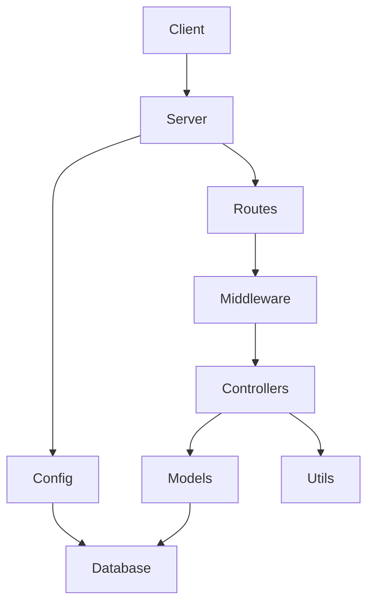

## 1. Stack
- Frontend: React 19, Vite, React Router DOM, Axios (MERN_Boilerplate/client/package.json)
- Backend: Node.js, Express 5 (MERN_Boilerplate/server/package.json)
- Database: MongoDB via Mongoose 9 (MERN_Boilerplate/server/package.json)
- Auth: jsonwebtoken + bcryptjs, httpOnly cookies (MERN_Boilerplate/server/index.js, README.md)
- Tooling: ESLint, Prettier, nodemon, Docker (client & server package.json, README.md)

## 2. Directory map
| path | what lives there |
|---|---|
| MERN_Boilerplate/client | React + Vite frontend app (src/, public/, Dockerfile) |
| MERN_Boilerplate/server | Express backend app, entry `index.js` |
| MERN_Boilerplate/server/config | MongoDB connection setup (`db.js`) |
| MERN_Boilerplate/server/controllers | Route handler logic (`auth.controller.js`) |
| MERN_Boilerplate/server/middleware | JWT auth middleware (`auth.middleware.js`) |
| MERN_Boilerplate/server/models | Mongoose schemas (`user.model.js`) |
| MERN_Boilerplate/server/routes | Route definitions (`auth.routes.js`) |
| MERN_Boilerplate/server/utils | Token helper (`generateToken.js`) |
| MERN_Boilerplate/docs | Project docs (`docs/README.md`) |
| Plan | Planning image (`Plan.png`) |

## 3. Diagram

## 4. Component index
- [[Client]]
- [[Server]]
- [[Config]]
- [[Routes]]
- [[Middleware]]
- [[Controllers]]
- [[Models]]
- [[Utils]]
- [[Database]]

## 5. Entry points
- Dev client: `cd MERN_Boilerplate/client && npm run dev` (vite) — entry `MERN_Boilerplate/client/src/main.jsx`
- Dev server: `cd MERN_Boilerplate/server && npm run dev` (nodemon) — entry `MERN_Boilerplate/server/index.js`
- Prod server: `cd MERN_Boilerplate/server && npm start` → `node index.js`
- Prod client: `cd MERN_Boilerplate/client && npm run build` (vite build), served via `npm run preview` or Docker
- Docker: `docker-compose up --build` from `MERN_Boilerplate/` (per README.md; docker-compose.yml itself not read)

## 6. Conventions
- ESM throughout: both package.json set `"type": "module"`; index.js/main.jsx/App.jsx all use `import`/`export`
- Server entry file is `index.js`, matching `"main": "index.js"` in server/package.json
- React components use `.jsx` extension (`main.jsx`, `App.jsx`)
- Server API routes mounted under `/api/<resource>` — e.g. `app.use('/api/auth', authRoutes)` (server/index.js)
- Server loads config via `dotenv.config()` and reads `process.env.*` (server/index.js)
- CORS restricted to `process.env.CLIENT_URL` with `credentials: true` (server/index.js)

## 7. Where things go
- New server API resource: model in `server/models/`, controller in `server/controllers/`, routes file in `server/routes/`, mount with `app.use('/api/<resource>', ...)` in `server/index.js` (mirrors existing auth wiring)
- New DB connection/config change: `server/config/db.js`
- New frontend page/UI: `client/src/App.jsx` (root component rendered by `client/src/main.jsx`)
- New env var: add to `server/.env` (server-only) or `client/.env` (must be `VITE_`-prefixed, per README.md)
- New Docker service: `MERN_Boilerplate/docker-compose.yml` (per README.md)
